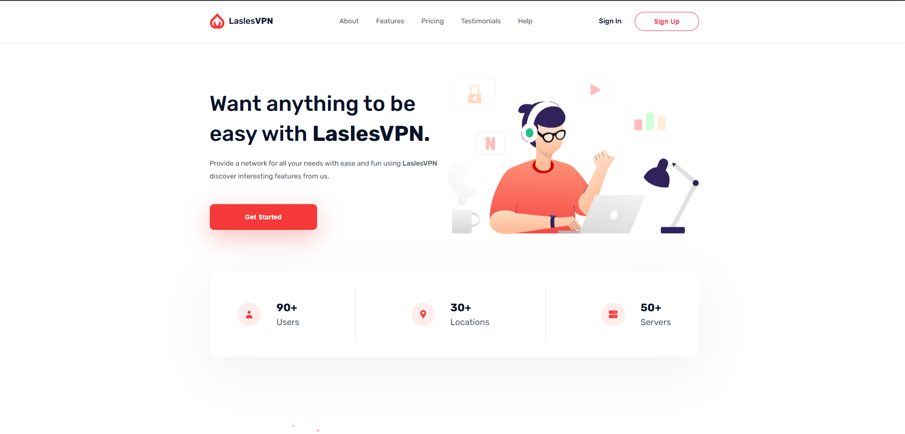

# LaslesVPN Landing Page

A responsive landing page built using HTML and CSS.

## Live Demo

https://ibrahim-almahdy.github.io/LaslesVPN/

## Preview



## Features

* Responsive Design
* Mobile Navigation Menu
* Sticky Header
* Hover Effects
* Floating Image Animations
* Pricing Plans Section
* Global Network Section
* Customer Testimonials
* Modern Footer Design

## Technologies Used

* HTML5
* CSS3
* Flexbox
* CSS Grid
* Media Queries
* Boxicons

## Responsive Design

The website is optimized for:

* Desktop
* Tablet
* Mobile

## What I Practiced

* Building responsive layouts
* Using Flexbox and CSS Grid
* Creating a mobile navigation menu
* Working with media queries
* Creating CSS animations
* Building a modern landing page

## Project Structure

```text
LaslesVPN/
│
├── index.html
├── css/
│   └── style.css
│
├── img/
│   ├── preview.png
│   └── ...
│
└── README.md
```

## Author

Ibrahim Elmahdy

GitHub:
https://github.com/Ibrahim-Almahdy
